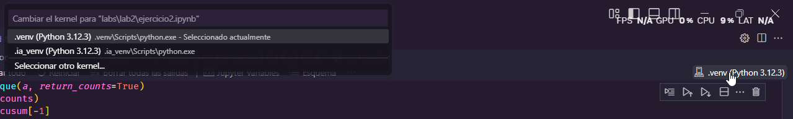
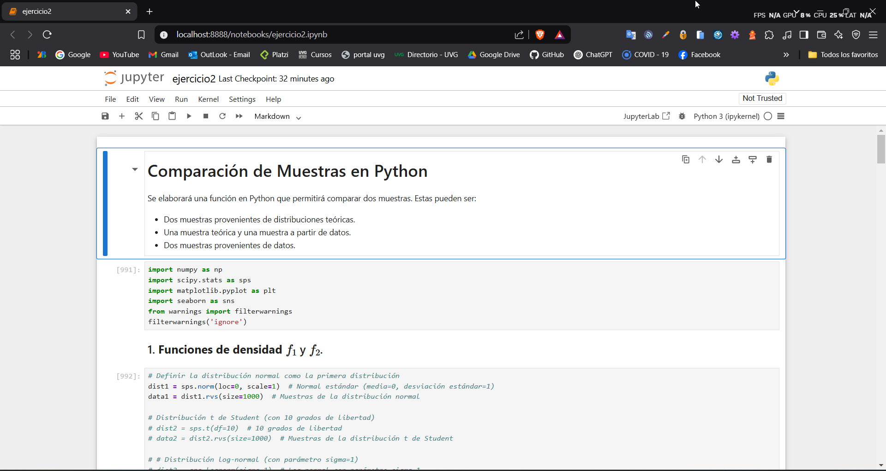

# 📊 Estadísticas y Análisis de Datos

Se exploran técnicas estadísticas y de simulación, como la estimación de densidad a partir de simulaciones de lanzamientos de moneda, la comparación de muestras mediante pruebas de Kolmogorov-Smirnov, y la aplicación de la ley de Benford en datos reales. Además, se abordan conceptos de análisis multivariado con la generación de muestras multivariadas y análisis de covarianza, el análisis de componentes principales en datos climáticos funcionales y la compresión de imágenes utilizando componentes principales para la reducción de dimensiones. Cada ejercicio permite explorar diversas metodologías de análisis y visualización de datos.

## 🐍 Entorno

**Lenguaje**: Python

**Versión**: 3.12.3

## 📂 Archivos principales

```bash
├── images/                    # Imágenes recolectadas usadas en los ejercicios
├── areas.csv                  # Dataset con áreas de los países (Ejercicio 3)
├── ejercicio1.ipynb           # Código del Ejercicio 1: Simulación de Lanzamientos de Moneda y Estimación de Densidad
├── ejercicio2.ipynb           # Código del Ejercicio 2: Comparación de Muestras y Prueba de Kolmogorov-Smirnov
├── ejercicio3.py              # Código del Ejercicio 3: Ley de Benford y Prueba de Ajuste en Datos Reales
├── ejercicio4.ipynb           # Código del Ejercicio 4: Generación de Muestra Multivariada y Análisis de Covarianz
├── ejercicio5.py              # Código del Ejercicio 5: Análisis de Componentes Principales en Datos Climáticos Funcionales
├── ejercicio6.ipynb           # Código del Ejercicio 6: Compresión de Imágenes con Análisis de Componentes Principales
├── README.md                  # Descripción del proyecto y laboratorio
├── requirements.txt           # Dependencias necesarias para el laboratorio
└── weather.csv                # Dataset con datos meteorológicos (Ejercicio 5)
```

## 🔄 Ejecución de Programas

1. **Clonar respositorio y cambiar de rama**:

   - Clona el repositorio usando el siguiente comando:

      ```bash
      git clone https://github.com/JosueSay/IntelligenceArtificial.git
      git checkout lab2
      ```

2. **Crear un entorno virtual**:

   - Crear un entorno virtual y activalo. Usa el siguiente comando:

      **PowerShell**

      ```bash
      python -m venv .venv
      cd .venv/Scripts
      Activate.ps1
      cd ../..
      ```

      **WSL/Linux**

      ```bash
      python -m venv .venv
      source .venv/bin/activate
      ```

   - Puedes omitir este paso si deseas instalar las dependencias en tu máquina.

3. **Instalar las dependencias**:
   - Instala las dependencias necesarias desde la raiz del repositorio:

     ```bash
     pip install -r .\labs\lab2\requirements.txt
     ```

     Esto instalará todas las librerías necesarias.

### Programas en Jupyter `(.ipynb)`

1. **Configurar el entorno en Jupyter**:

   - En el kernel de Jupyter Notebook selecciona el entorno virtual creado; si instalaste las librerias fuera de un entorno selecciona el interprete de python utilizado.

      

2. **Ejecutar el script**:
   - Corre las instrucciones de los ejercicios `.ipynb`. Si quieres correrlo en el navegador puedes usar el comando desde la raiz de la carpeta del repositorio:

      ```bash
      jupyter notebook .\labs\lab2\nombre_archivo.ipynb
      ```

      

### Programas en Python `(.py)`

Se debe tener docker instalado y ejecutar el comando:

```sh
docker buildx build -t ia_lab2 .    
docker run --rm -v "$(pwd)/images:/app/images" -v "$(pwd)/areas.csv:/app/areas.csv" ia_lab2 
```
