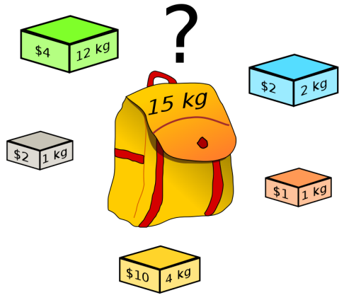
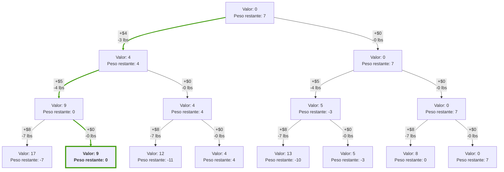

# Problema Knapsack Binario

El **problema Knapsack binario** consiste en seleccionar un subconjunto de objetos para maximizar su valor total sin exceder la capacidad de una mochila. Se tienen $n$ objetos, cada uno con un valor $v_i$ y un peso $w_i$, y una mochila con una capacidad máxima $K \geq 0$.

## Detalle del Problema

Dado un conjunto de $n$ objetos numerados del $1$ al $n$, cada objeto tiene:

- Un **valor** $v_i$, que puede representar el precio, la importancia, utilidad, etc.
- Un **peso** $w_i$, que representa cuánto espacio ocupa en la mochila.

Cada objeto **solo puede ser tomado una vez** (es decir, no hay múltiples copias disponibles).  

El objetivo es seleccionar un subconjunto de objetos de manera que:

1. **Maximice la suma de los valores** de los objetos seleccionados.
2. **No exceda la capacidad de la mochila** $K$.

### Condiciones del Problema

- Se tienen **$n$ objetos distintos**.
- Cada objeto $i$ tiene un valor $v_i$ y un peso $w_i$, donde $v_i, w_i \in \mathbb{N}^+$.
- Solo se puede incluir un objeto $i$ **una vez o no incluirlo**.
- La capacidad de la mochila es $K$.

## Representación Matemática

El problema se puede formular como un problema de optimización:

$$
\max \sum_{i=1}^{n} v_i \cdot x_i
$$

donde $x_i$ es una variable binaria:

$$
x_i \in \{0,1\}
$$

con la restricción de peso:

$$
\sum_{i=1}^{n} w_i \cdot x_i \leq K
$$

Aquí, $x_i = 1$ indica que el objeto $i$ se incluye en la mochila, y $x_i = 0$ indica que no se incluye. Esto representa la función de utilidad ya que deseamos maximizar la ganancia del valor de los productos pero atado a un crecimiento de peso limitado por la capacidad de la mochila.

## Espacio

### 1. Espacio de Búsqueda $\Omega$

El espacio de búsqueda $\Omega$ representa **todas las posibles combinaciones** de objetos que se pueden seleccionar dentro de la mochila, sin considerar la restricción de capacidad.  

Dado que cada objeto **se puede incluir o no**, cada uno tiene **dos opciones**:  

1. **No incluirlo** ($x_i = 0$)  
2. **Incluirlo** ($x_i = 1$)  

Por lo tanto, como hay $n$ objetos y cada uno puede estar en dos estados, el espacio de búsqueda es:  

$$
\Omega = \{0,1\}^n
$$

El número total de combinaciones posibles es:

$$
|\Omega| = 2^n
$$

Esto indica que el número de combinaciones **crece exponencialmente** con $n$, lo que hace que el problema sea **NP-completo**, ya que una búsqueda exhaustiva requeriría evaluar todas estas configuraciones.  

### 2. Espacio de Configuraciones Válidas

El espacio de configuraciones válidas es **un subconjunto de $\Omega$** y solo incluye aquellas combinaciones que cumplen la restricción de peso:

$$
\sum_{i=1}^{n} w_i \cdot x_i \leq K
$$

El **tamaño de este subconjunto** es menor o igual a $2^n$, pero su valor exacto depende de los pesos $w_i$ y de la capacidad $K$.  

## Descripción del Problema con Estructura

El problema de la **Mochila Binaria** se puede representar como un **árbol de decisiones**, donde cada nodo indica una decisión: **incluir o no un objeto** en la mochila.  

### Estructura del Árbol

- Cada nivel del árbol representa una elección sobre un objeto.  
- Cada nodo contiene la **suma de valores** obtenidos y el **peso restante** en la mochila.  
- Las ramas representan las decisiones posibles:  
  - **Incluir el objeto** → Aumenta el valor total y reduce la capacidad restante.  
  - **No incluir el objeto** → Mantiene el mismo valor y peso disponible.  

A continuación, se muestra un ejemplo con:  

- **Pesos:** $[3, 4, 7]$
- **Valores:** $[4, 5, 8]$
- **Capacidad máxima:** $7$

**Interpretación del árbol:**

- El nodo raíz representa el estado inicial (sin objetos en la mochila).  
- A medida que se desciende en el árbol, se toman decisiones sobre cada objeto.  
- Los nodos resaltados representan una de las mejores soluciones factibles.  
