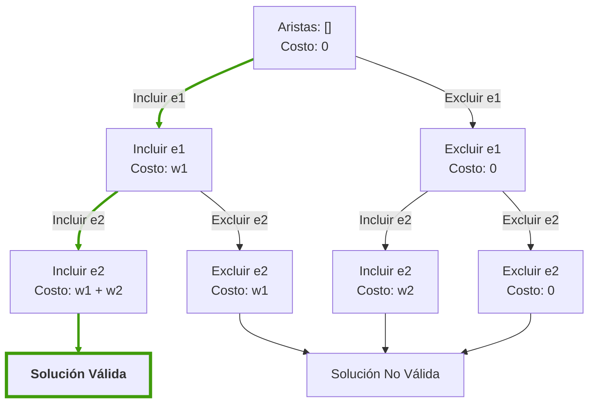

# Problema del Árbol de Expansión Mínima

El **problema del Árbol de Expansión Mínima (MST)** consiste en encontrar un subconjunto de aristas que conecten todos los vértices de un grafo conexo, no dirigido y ponderado, sin formar ciclos y minimizando el peso total de las aristas.

## Detalle del Problema

Dado un **grafo no dirigido y ponderado** $G = (V, E)$ donde:

- $V$ es el conjunto de **nodos o vértices**.
- $E$ es el conjunto de **aristas** que conectan pares de vértices, cada una con un peso asociado $w(e)$.

El objetivo es encontrar un subconjunto de aristas $T \subseteq E$ tal que:

1. **Conecte todos los vértices** del grafo.  
2. **No forme ciclos** (es un árbol).  
3. **Minimice el peso total**, definido por la siguiente **función de costo**:

$$
\text{Costo}(T) = \sum_{e \in T} w(e)
$$

donde $w(e)$ es el peso de cada arista $e$ en el conjunto $T$.

## Representación Matemática

- El grafo es **conexo**, es decir, existe un camino entre cualquier par de vértices.  
- No se permiten ciclos en la solución.  
- El conjunto resultante debe tener exactamente **$n-1$ aristas** si el grafo tiene $n$ vértices.  
- Cada arista tiene un **peso positivo**.  

Se define como el subconjunto $T \subseteq E$ tal que:

$$
\min_{T \subseteq E} \sum_{e \in T} w(e)
$$

sujeto a:

1. $T$ **conecta todos los vértices** del grafo.  
2. $T$ **no contiene ciclos**.  
3. $|T| = n - 1$ aristas.

## Espacio

### 1. Espacio de Búsqueda $\Omega$

El espacio de búsqueda $\Omega$ está conformado por **todos los subconjuntos posibles de aristas** del grafo $G$ que conectan todos los vértices sin formar ciclos, es decir, todos los posibles árboles de expansión.

- Cada arista del grafo puede **ser incluida o no** en una posible solución.
- Dado un grafo con $m$ aristas, el espacio total de subconjuntos es:

$$
|\Omega| = 2^m
$$

Sin embargo, no todos estos subconjuntos forman árboles válidos. Solo aquellos que conectan todos los vértices y no tienen ciclos son configuraciones válidas.

### 2. Espacio de Configuraciones Válidas

El espacio de configuraciones válidas es el conjunto de todos los **árboles de expansión** posibles del grafo.

- Cada configuración válida contiene **exactamente $n-1$ aristas**, donde $n$ es el número de vértices del grafo.
- Entre estas configuraciones, se busca aquella con el **menor peso total**.

## Descripción del Problema con Estructura

El problema se puede representar como un **árbol de decisiones**, donde cada nodo representa una decisión sobre incluir o excluir una arista en la solución.

### Estructura del Árbol de Decisiones

- Cada nivel del árbol representa una decisión sobre una arista del grafo.
- Las ramas representan las decisiones posibles:
  - **Incluir la arista** → Se conecta un par de nodos y se suma su peso.
  - **Excluir la arista** → Se omite esa arista en la solución.
- Los nodos hoja representan soluciones completas:
  - Si forman un árbol válido (conectan todos los nodos sin ciclos), se evalúa su costo.
  - Si no forman un árbol válido, se descartan.

A continuación, se muestra un ejemplo con un grafo de 4 vértices y 5 aristas con pesos asociados.

**Interpretación del Árbol:**

- El nodo raíz representa el estado inicial sin aristas seleccionadas.
- Las ramas del árbol representan las decisiones de incluir o excluir cada arista.
- El nodo resaltado representa una de las soluciones válidas con el menor costo total.
