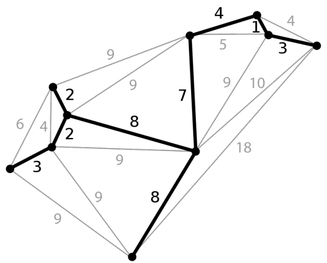

# Problema del Árbol de Expansión Mínima

El problema de hallar el árbol de expansión mínima un grafo conexo de $n$ nodos. Las conexiones no están completas y sólo es válido circular por las aristas del grafo.

## Tareas

Representar cada uno de los siguientes problemas como un problema de búsqueda. Para cada problema, indicar:

- El espacio de configuraciones (espacio de búsqueda) Ω.
- El tamaño de Ω.
- Una descripción de las configuraciones (vectores, matrices, permutaciones, grafos, árboles, etc.)
- Una métrica o función de costo a optimizar para resolver el problema.
- Elabore una gráfica del árbol de búsqueda (los primeros 2 ó 3 niveles de profundidad).
