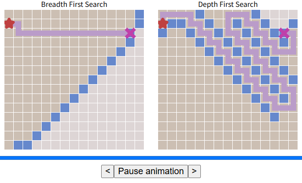

# Laboratorio 4

En este laboratorio vamos a simular y comparar las diferencias entre varios métodos de búsqueda: (1) DFS, (2) BFS, (3) Greedy Search y (4) A∗.

## Pregunta 1

- Ingresar al sitio <https://cs.stanford.edu/people/abisee/tutorial/bfsdfs.html>.  
- Realizar varios experimentos y comparaciones, variando:  
  - La posición del inicio y el objetivo
  - Agregando paredes y obstáculos

- Ejemplos hechos:

  - **Configuración 1:**

    

  - **Configuración 2:**  

    

  - **Configuración 3:**  

    

  - **Configuración 4:**  

    

### a. ¿BFS regresa siempre el camino más corto? ¿Por qué?

Sí, porque BFS explora nivel por nivel, asegurando que encuentre el objetivo en la menor cantidad de pasos posibles antes de expandir caminos más largos.

- BFS expande primero los nodos más cercanos antes de moverse a los más profundos.
- Como resultado, tan pronto como encuentra el objetivo, se garantiza que ha usado el menor número de pasos posibles.

Guiándonos por las configuraciones:

- En los experimentos, cuando BFS encuentra el objetivo, la ruta es directa y óptima.
- Incluso con obstáculos, BFS encuentra el camino más corto alrededor de ellos.

### b. ¿DFS regresa siempre el camino más corto? ¿Por qué?

No, porque explora primero un camino hasta el final antes de retroceder y probar otra opción, llegando a encontrar una solución rápida pero no la más corta. Como este enfoque no prioriza los caminos más cortos, puede recorrer caminos largos antes de encontrar la solución óptima.

Guiándonos por las configuraciones:

- DFS tomaba rutas más largas e incluso daba rodeos innecesarios.
- Podía encontrar la solución, pero en un camino mucho más largo que BFS.
- En escenarios con obstáculos, se desvía bastante.

### c. Una vez que el objetivo es hallado, ¿cómo los algoritmos encuentran el camino?

- **BFS:** expande todos los nodos a un mismo nivel antes de avanzar; puede rastrear el camino más corto desde el objetivo de regreso al inicio.
- **DFS:** realiza un recorrido por todo el grid y, una vez que encuentra el objetivo, debe retroceder hasta el nodo de origen siguiendo el camino que tomó.

### d. Mencione desventajas del BFS y del DFS

- **Desventajas de BFS:**
  - Al explorar todos los nodos por nivel, BFS consume mucha memoria, ya que guarda en memoria todos los nodos del nivel actual y del siguiente.

- **Desventajas de DFS:**
  - Puede encontrar una solución rápidamente, pero no garantiza que sea la más corta.
  - Puede perderse en caminos largos o en ciclos si no se controla adecuadamente.

## Pregunta 2

- Ingresar al sitio <https://cs.stanford.edu/people/abisee/tutorial/astar.html>.  
- Realizar varios experimentos y comparaciones, variando:  
  - La posición del inicio y el objetivo
  - Agregando paredes y obstáculos

- Ejemplos hechos:

  - **Configuración 1:**

    

  - **Configuración 2:**  

    

  - **Configuración 3:**  

    

  - **Configuración 4:**  

    

### a. ¿Es el algoritmo Greedy óptimo (es decir, siempre regresa el camino más corto)? ¿Por qué?

No, Greedy Search no es óptimo porque trabaja bajo la suposición de que la heurística es completamente correcta. Si ese fuera el caso, puede devolver una solución rápida, ya que la heurística actúa como una brújula. Sin embargo, en la práctica no siempre retorna el camino óptimo. Esto ocurre, por ejemplo, en presencia de obstáculos, donde Greedy puede comportarse de forma ineficiente, repitiendo o retrocediendo pasos. Esto sucede porque se guía exclusivamente por minimizar la heurística, y si en algún punto el valor minimizado ya no permite avanzar, debe retroceder y reiniciar la búsqueda, lo que incrementa los pasos hacia el objetivo. En resumen, no observa el panorama completo, solo la dirección aparente más prometedora.

**Guiándonos por las configuraciones:**

- Tanto BFS como A* Search realizan la misma cantidad de pasos.
- Greedy ejecuta más pasos, ya que sigue únicamente la heurística minimizada, lo que lo lleva por rutas más largas hasta alcanzar el objetivo.

### b. Mencione ventajas y desventajas de Greedy Search

**Ventajas:**

- Es rápido y, dependiendo de la calidad de la heurística, puede encontrar una solución aceptable con bajo costo computacional.
- En espacios de búsqueda finitos, puede ser completo (encontrar una solución si existe).

**Desventajas:**

- No garantiza encontrar el camino más corto.
- Puede quedar atrapado en caminos subóptimos o no encontrar solución si la heurística no está bien diseñada.

### c. ¿Cuál algoritmo es el más rápido?

El algoritmo más rápido es Greedy Search, ya que se guía únicamente por la heurística y no evalúa el costo total del camino. En contraste:

- **BFS** explora todos los caminos a una misma profundidad, lo que lo hace más lento.
- **A*** combina UCS (para optimalidad) y Greedy (para dirección heurística), por lo que es más lento que Greedy pero más rápido que BFS.

### d. ¿Cuál es el que explora la mayor área antes de hallar el camino al objetivo?

BFS es el que explora la mayor área, ya que expande todos los caminos posibles a la misma profundidad antes de avanzar. Esto se debe a que su objetivo es garantizar la solución óptima (en este ejemplo, asociada a la menor cantidad de pasos). Por eso, examina todos los nodos vecinos en cada nivel antes de proceder. En los experimentos, se observa cómo BFS incluso mapea todo el grid en el primer ejemplo, mientras que los demás algoritmos exploran áreas más reducidas.

### e. ¿A* y BFS siempre hallan el mismo camino?

Sí, en este caso ambos hallan el mismo camino. Esto se debe a que BFS encuentra el camino óptimo al estar diseñado para buscar la solución a menor profundidad (es decir, menos movimientos, lo que implica menor costo si todos los pasos tienen el mismo valor). A* también encuentra el mismo camino porque combina la misma función de costo que BFS (número de pasos) con la heurística, logrando así el mismo resultado óptimo.

## Problema 3

- Ingresar al sitio <https://cs.stanford.edu/people/abisee/tutorial/customize.html>.  
- Realizar varios experimentos y comparaciones, variando:  
  - La posición del inicio y el objetivo
  - Agregando paredes y obstáculos

- Ejemplos hechos:

  - **Configuración 1:**

    

  - **Configuración 2:**  

    

  - **Configuración 3:**  

    

  - **Configuración 4:**  

    

### a. ¿Se puede modificar el mapa de forma que A* termine mucho más rápido que Dijkstra?

### b. ¿Dijkstra y A*ponderado (weighted A*) siempre encuentran caminos diferentes?  

### c. ¿Cuál es más rápido, Dijkstra o A* ponderado? ¿Siempre o solo en algunas ocasiones?

## Problema 4

Diseñar heurísticas para los siguientes problemas. Para cada una de ellas, indicar (de ser posible) si es una heurística admisible o no.

### a. Problema del TSP - Basado en Árbol de Expansión Mínima

#### Formulación Matemática Extendida

La heurística para el Problema TSP se define como:

$$h_{TSP}(n) = MST(C_R) + \min_{i \in C_V, j \in C_R} c(i,j) + \min_{k,l \in C_R, k \neq l} c(k,l)$$

donde:

- $C_V$ es el conjunto de ciudades visitadas
- $C_R$ es el conjunto de ciudades restantes por visitar
- $c(i,j)$ es el costo del arco entre las ciudades $i$ y $j$

#### Demostración de Admisibilidad

- **Componente MST**:

  - Sea $H$ el tour óptimo restante. Si se elimina un arco de $H$, se obtiene un árbol de expansión.
  - Por definición de MST: $MST(C_R) \leq costo(H^* - \text{un arco})$
  - Por lo tanto: $$MST(C_R) \leq costo(H) - \min(\text{arcos de } H)$$

- **Componentes de conexión**:

  - Necesitamos al menos un arco para conectar el último nodo visitado ($i \in C_V$) a $C_R$
  - Necesitamos al menos un arco para regresar al inicio desde $C_R$
  - El mínimo global $\min_{k,l \in C_R} c(k,l)$ es un límite inferior para ambos

Matemáticamente, para cualquier tour completo $T$ que extienda el estado actual:

$$MST(C_R) + c_{min1} + c_{min2} \leq costo(T)$$

### b. 8-Puzzle, (Basado en distancia Manhattan )

La heurística se define como:

$$h_{8P}(s) = \sum_{i=1}^8 d_M(i) + 2 \cdot LC(s)$$

donde $d_M(i) = |x_i - g_{ix}| + |y_i - g_{iy}|$ es la distancia Manhattan para la ficha $i$.

#### Teorema de Conflictos Lineales

Un conflicto lineal ocurre cuando dos fichas $i$ y $j$ en la misma fila/columna satisfacen:

- Ambas están en su fila/columna objetivo
- $(x_i - g_{ix})(x_j - g_{jx}) < 0$ (sentidos opuestos)
- $|g_{ix} - g_{jx}| < |x_i - x_j|$ (se interponen)

Cada par de fichas en conflicto añade al menos 2 movimientos adicionales:

- Mover una ficha fuera de la fila/columna (+1)
- Moverla de regreso después (+1)

#### Demostración de Consistencia

Para cualquier movimiento válido $a$ del estado $s$ a $s'$:

$$h(s) \leq c(s,a,s') + h(s')$$

Esto se cumple porque:

- La distancia Manhattan de una ficha cambia en $\pm 1$ por movimiento
- Los conflictos lineales solo pueden resolverse o reducirse con movimientos que compensen el cambio en $h$

### c. Torres de Hanoi, (Basado en Análisis Recursivo)

#### Formulación Recursiva

Para $n$ discos, se define la heurística como:

$$h_{TH}(s) = \sum_{i=1}^n 2^{i-1} \cdot \delta_i(s)$$

donde $$\delta_i(s) = \begin{cases} 0 & \text{si disco } i \text{ está en torre destino con discos menores encima} \ 1 & \text{en otro caso} \end{cases}$$

#### Demostración por Inducción

**Caso base**: Para 1 disco, $h_{TH}(s) = 1$ si no está en destino (óptimo).

**Paso inductivo**: Asumimos válido para $k$ discos. Para $k+1$:

- Si disco $k+1$ no está en destino: necesita al menos $2^k$ movimientos (por hipótesis inductiva)
- Los $k$ discos menores deben moverse dos veces (antes y después de mover $k+1$)

La suma de pesos $2^{i-1}$ captura exactamente esta estructura recursiva.
