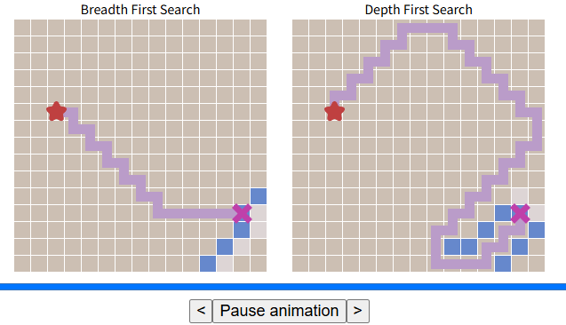
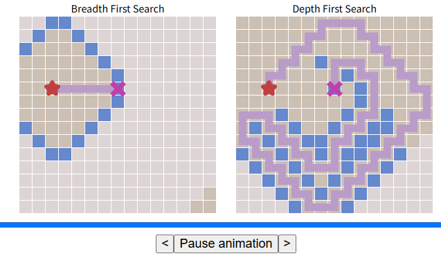

# Pregunta 1

- Ingresar al sitio <https://cs.stanford.edu/people/abisee/tutorial/bfsdfs.html>.  
- Realizar varios experimentos y comparaciones, variando:  
  - La posición del inicio y el objetivo
  - Agregando paredes y obstáculos

- Ejemplos hechos:

  - **Configuración 1:**

    

  - **Configuración 2:**  

    

  - **Configuración 3:**  

    

  - **Configuración 4:**  

    

## a. ¿BFS regresa siempre el camino más corto? ¿Por qué?

Sí, porque BFS explora nivel por nivel, asegurando que encuentre el objetivo en la menor cantidad de pasos posibles antes de expandir caminos más largos.

- BFS expande primero los nodos más cercanos antes de moverse a los más profundos.
- Como resultado, tan pronto como encuentra el objetivo, se garantiza que ha usado el menor número de pasos posibles.

Guiándonos por las configuraciones:

- En los experimentos, cuando BFS encuentra el objetivo, la ruta es directa y óptima.
- Incluso con obstáculos, BFS encuentra el camino más corto alrededor de ellos.

## b. ¿DFS regresa siempre el camino más corto? ¿Por qué?

No, porque explora primero un camino hasta el final antes de retroceder y probar otra opción, llegando a encontrar una solución rápida pero no la más corta. Como este enfoque no prioriza los caminos más cortos, puede recorrer caminos largos antes de encontrar la solución óptima.

Guiándonos por las configuraciones:

- DFS tomaba rutas más largas e incluso daba rodeos innecesarios.
- Podía encontrar la solución, pero en un camino mucho más largo que BFS.
- En escenarios con obstáculos, se desvía bastante.

## c. Una vez que el objetivo es hallado, ¿cómo los algoritmos encuentran el camino?

- **BFS:** expande todos los nodos a un mismo nivel antes de avanzar; puede rastrear el camino más corto desde el objetivo de regreso al inicio.
- **DFS:** realiza un recorrido por todo el grid y, una vez que encuentra el objetivo, debe retroceder hasta el nodo de origen siguiendo el camino que tomó.

## d. Mencione desventajas del BFS y del DFS

- **Desventajas de BFS:**
  - Al explorar todos los nodos por nivel, BFS consume mucha memoria, ya que guarda en memoria todos los nodos del nivel actual y del siguiente.

- **Desventajas de DFS:**
  - Puede encontrar una solución rápidamente, pero no garantiza que sea la más corta.
  - Puede perderse en caminos largos o en ciclos si no se controla adecuadamente.
