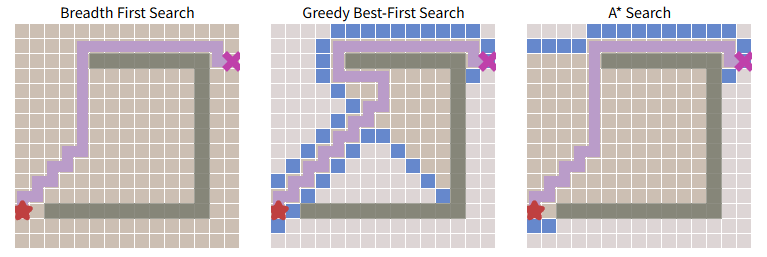
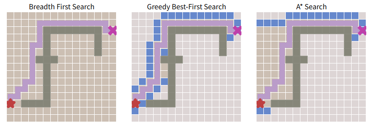
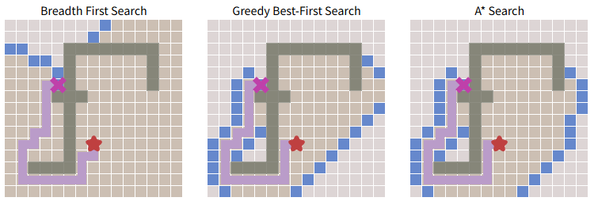
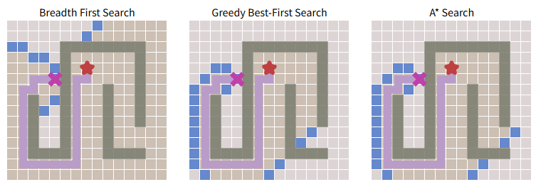

# Pregunta 2

- Ingresar al sitio <https://cs.stanford.edu/people/abisee/tutorial/astar.html>.  
- Realizar varios experimentos y comparaciones, variando:  
  - La posición del inicio y el objetivo
  - Agregando paredes y obstáculos

- Ejemplos hechos:

  - **Configuración 1:**

    

  - **Configuración 2:**  

    

  - **Configuración 3:**  

    

  - **Configuración 4:**  

    

## a. ¿Es el algoritmo Greedy óptimo (es decir, siempre regresa el camino más corto)? ¿Por qué?

No, Greedy Search no es óptimo porque trabaja bajo la suposición de que la heurística es completamente correcta. Si ese fuera el caso, puede devolver una solución rápida, ya que la heurística actúa como una brújula. Sin embargo, en la práctica no siempre retorna el camino óptimo. Esto ocurre, por ejemplo, en presencia de obstáculos, donde Greedy puede comportarse de forma ineficiente, repitiendo o retrocediendo pasos. Esto sucede porque se guía exclusivamente por minimizar la heurística, y si en algún punto el valor minimizado ya no permite avanzar, debe retroceder y reiniciar la búsqueda, lo que incrementa los pasos hacia el objetivo. En resumen, no observa el panorama completo, solo la dirección aparente más prometedora.

**Guiándonos por las configuraciones:**

- Tanto BFS como A* Search realizan la misma cantidad de pasos.
- Greedy ejecuta más pasos, ya que sigue únicamente la heurística minimizada, lo que lo lleva por rutas más largas hasta alcanzar el objetivo.

## b. Mencione ventajas y desventajas de Greedy Search

**Ventajas:**

- Es rápido y, dependiendo de la calidad de la heurística, puede encontrar una solución aceptable con bajo costo computacional.
- En espacios de búsqueda finitos, puede ser completo (encontrar una solución si existe).

**Desventajas:**

- No garantiza encontrar el camino más corto.
- Puede quedar atrapado en caminos subóptimos o no encontrar solución si la heurística no está bien diseñada.

## c. ¿Cuál algoritmo es el más rápido?

El algoritmo más rápido es Greedy Search, ya que se guía únicamente por la heurística y no evalúa el costo total del camino. En contraste:

- **BFS** explora todos los caminos a una misma profundidad, lo que lo hace más lento.
- **A*** combina UCS (para optimalidad) y Greedy (para dirección heurística), por lo que es más lento que Greedy pero más rápido que BFS.

## d. ¿Cuál es el que explora la mayor área antes de hallar el camino al objetivo?

BFS es el que explora la mayor área, ya que expande todos los caminos posibles a la misma profundidad antes de avanzar. Esto se debe a que su objetivo es garantizar la solución óptima (en este ejemplo, asociada a la menor cantidad de pasos). Por eso, examina todos los nodos vecinos en cada nivel antes de proceder. En los experimentos, se observa cómo BFS incluso mapea todo el grid en el primer ejemplo, mientras que los demás algoritmos exploran áreas más reducidas.

## e. ¿A* y BFS siempre hallan el mismo camino?

Sí, en este caso ambos hallan el mismo camino. Esto se debe a que BFS encuentra el camino óptimo al estar diseñado para buscar la solución a menor profundidad (es decir, menos movimientos, lo que implica menor costo si todos los pasos tienen el mismo valor). A* también encuentra el mismo camino porque combina la misma función de costo que BFS (número de pasos) con la heurística, logrando así el mismo resultado óptimo.
