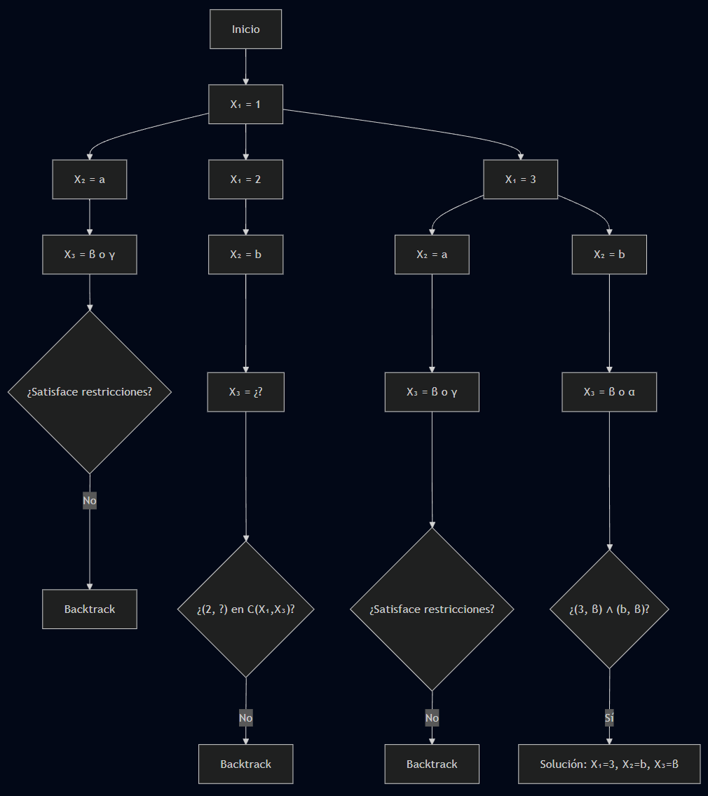
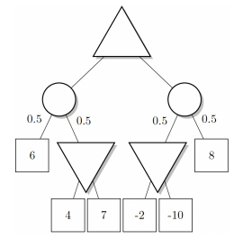
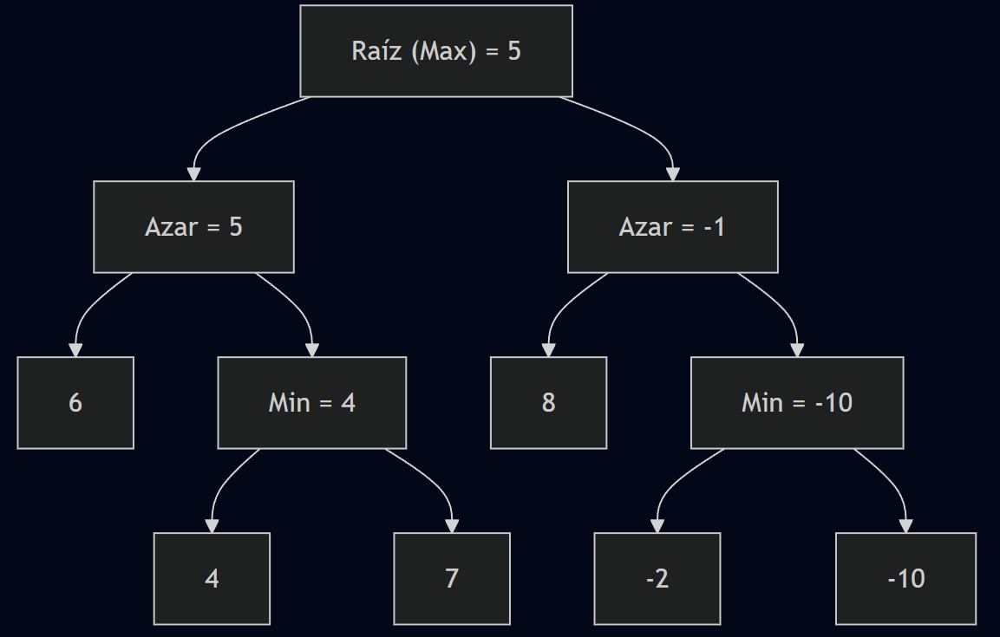
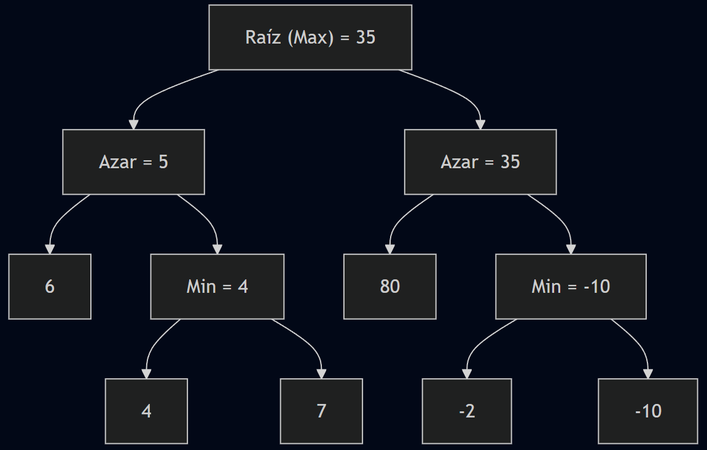
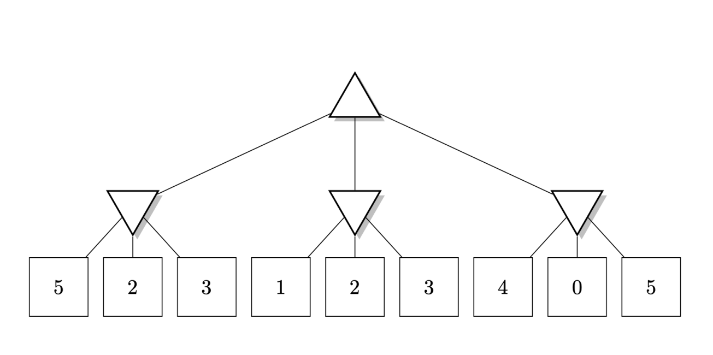

---
header-includes:
  - \usepackage{amsmath}
  - \usepackage{amssymb}
  - \usepackage{fontspec}
  - \setmainfont{FiraCode Nerd Font}
  - \setmonofont{FiraCode Nerd Font Mono}
  - \usepackage{setspace}
  - \setstretch{1.5}
  - \usepackage{fvextra}
  - \DefineVerbatimEnvironment{Highlighting}{Verbatim}{breaklines,commandchars=\\\{\}}
geometry: top=0.67in, bottom=0.67in, left=0.85in, right=0.85in
---

# Laboratorio 5

En este laboratorio se resuelven problemas de satisfacción de restricciones (CSP) y búsqueda adversaria utilizando algoritmos de backtracking, expectiminimax, minimax y poda alfa-beta.

## Problema 1

1. Considere el problema de satisfacción de restricciones (CSP) que se describe a continuación.

- **Variables:** $X_1, X_2, X_3$.
- **Dominios:** $D_1 = \{1, 2, 3, 4\}$, $D_2 = \{a, b, c\}$, $D_3 = \{\alpha, \beta, \gamma\}$.
- **Restricciones:**

$$
C(X_1, X_2) = \{(1, a), (2, b), (3, a), (3, b), (4, b)\}, \tag{1}
$$

$$
C(X_1, X_3) = \{(1, \beta), (3, \beta), (4, \beta)\}, \tag{2}
$$

$$
C(X_2, X_3) = \{(a, \gamma), (b, \beta), (b, \alpha), (c, \gamma)\}. \tag{3}
$$

Resolver el problema usando el algoritmo de *backtracking*.

**Orden de asignación:** $X_1 \to X_2 \to X_3$

**1. Asignar $X_1$**

- Valores posibles: $\{1, 2, 3, 4\}$

- Probamos **$X_1 = 1$**

**2. Asignar $X_2$**

- Dado $X_1 = 1$, buscamos $(1, x)$ en $C(X_1, X_2) \Rightarrow x = a$

- Entonces probamos **$X_2 = a$**

**3. Asignar $X_3$**

Verificamos dos restricciones:

- $(X_1, X_3) = (1, ?)$ debe estar en $C(X_1, X_3) \Rightarrow (1, \beta)$  
- $(X_2, X_3) = (a, ?)$ debe estar en $C(X_2, X_3) \Rightarrow (a, \gamma)$

Pero no hay **intersección** entre los valores válidos:  
$\beta \not= \gamma$ -> **falla**

Volvemos a $X_2$ -> no hay otro valor que cumpla $(1, x)$ en $C(X_1, X_2)$  
-> **backtrack a $X_1$**

**Probar $X_1 = 2$**

$C(X_1, X_2)$: $(2,b)$

-> $X_2 = b$

**Verificar $X_3$**

- $C(X_1, X_3):$ $(2, ?)$ -> **no está en ninguna tupla** -> **falla**  
-> **backtrack**

**Probar $X_1 = 3$**

$C(X_1, X_2): (3,a), (3,b)$ -> probamos **$X_2 = a$**

$C(X_1, X_3): (3, \beta)$  
$C(X_2, X_3): (a, \gamma)$ -> no hay intersección -> **falla**

Probar **$X_2 = b$**

$C(X_2, X_3):$ $(b, \beta), (b, \alpha)$  
Intersección con $(3, \beta)$ => $X_3 = \beta$ válido

### Solución encontrada

$$
X_1 = 3,\quad X_2 = b,\quad X_3 = \beta
$$

### Representación del proceso

{height=250px}

## Problema 2

Considere el juego de suma cero para dos jugadores, con elementos de azar representados en el siguiente árbol.  
Los triángulos que apuntan hacia arriba son nodos de **maximización**, los triángulos que apuntan hacia abajo son nodos de **minimización**, los círculos son nodos de **azar** (con las probabilidades de alcanzar el siguiente nodo indicadas en las aristas salientes), y los cuadrados son **nodos terminales** con el valor correspondiente de la función de utilidad para el jugador que maximiza.

### Calcule el valor **expectiminimax** del nodo raíz y determine la acción elegida por el jugador que maximiza

- Nodo de minimización con hijos: 4 y 7
  $$\min(4, 7) = 4$$

- Nodo de azar con hijos: 6 y 4  
  $$0.5 \cdot 6 + 0.5 \cdot 4 = 3 + 2 = 5$$

- Nodo de minimización con hijos: -2 y -10
  $$\min(-2, -10) = -10$$

- Nodo de azar con hijos: 8 y -10  
  $$0.5 \cdot 8 + 0.5 \cdot (-10) = 4 - 5 = -1$$

- Nodo raíz
  $$\max(5, -1) = 5$$

#### Resultado

- **Valor expectiminimax de la raíz**: **5**  
- **Acción elegida**: **ir al subárbol izquierdo**

{height=180px}

### ¿Cambiaría el jugador que maximiza de acción si el pago 8 cambiara a 80?

Cambia el nodo derecho:

$$0.5 \cdot 80 + 0.5 \cdot (-10) = 40 - 5 = 35$$

Ahora el nodo raíz decide entre:

- Subárbol izquierdo: 5  
- Subárbol derecho: 35  

$$\max(5, 35) = 35$$

{height=180px}

#### Resultado

- **Con 8**: elige el **subárbol izquierdo** (valor 5)
- **Con 80**: elige el **subárbol derecho** (valor 35)

**La acción sí cambia si el valor terminal 8 cambia a 80.**

## Problema 3

Considere el siguiente árbol que representa un juego de suma cero, donde los triángulos que apuntan hacia arriba son nodos
de maximizaci´on, los triángulos que apuntan hacia abajo son nodos de minimización y los cuadrados son nodos terminales
con el valor correspondiente de la función de utilidad para el jugador que maximiza
.

### Algoritmo minimax

Empezamos desde abajo en el nodo izquierdo (donde se ubican los nodos con valores {5,2,3}),  vemos que el nivel de arriba tiene nodos que minimizan, por lo que debemos escoger el valor menor, en este caso es 2. 

Luego vamos a la parte central {1,2,3}, ya sabemos que el nivel de arriba minimiza, por lo que escogemos 1. 

Luego, en el extremo derecho observamos que el valor menor es 0, por lo tanto lo escogemos. 

Ahora, con las elecciones realizadas, vemos que el el nivel 2 quedan estos valores: {2, 1, 0}. El nodo raíz tiene el objetivo de maximizar, por lo tanto el mejor camino es el que tiene al número 2, el que está más a la izquierda. 

Usando el algoritmo minimax, concluimos que la mejor acción del jugador max es escoger el nodo que está más a la izquierda. 

### Poda alpha beta

Seteamos $$\alpha$$ como $$-\inf$$ y $$\beta$$ como $$\inf$$

## Problema 4

### Algoritmo Minimax

Primero calculo los valores de los nodos del nivel inferior

- Primer nodo: min(-2, 4) = -2
- Segundo nodo: min(6, -8) = -8
- Tercer nodo: min(-3, -1) = -3
- Cuarto nodo: min(7, -5) = -5
- Quinto nodo: min(2, -4) = -4
- Sexto nodo: min(-6, 8) = -6
- Séptimo nodo: min(3, 1) = 1
- Octavo nodo: min(-7, 5) = -7

Nivel 3

- Primer nodo: max(-2, -8) = -2
- Segundo nodo: max(-3, -5) = -3
- Tercer nodo: max(-4, -6) = -4
- Cuarto nodo: max(1, -7) = 1

Nivel 2

- Primer nodo: min(-2, -3) = -3
- Segundo nodo: min(-4, 1) = -4

Nivel 1

- Raíz: max(-3, -4) = -3

**Respuesta**: Aplicando el algoritmo minimax, y con base a los calculos, la mejor acción para el jugador máximo en la raíz es elegir la rama izquierda que conduce a un valor minimax de -3.

### Algoritmo Minimax con Poda Alfa-Beta

Empezando en la raíz (max), con $\alpha = -\infty, \beta = \infty$:

1. En la rama izquierda con $\alpha = -\infty, \beta = \infty$:
   - El primer hijo, con $\alpha = -\infty, \beta = \infty$:
     - Primer nodo min: devuelve -2
     - Ahora $\alpha = -2$
     - Segundo nodo min: devuelve -8
     - Valor de este nodo max = -2
   - Este nodo min actualiza $\beta = -2$

   - Luego segundo hijo con $\alpha = -\infty, \beta = -2$:
     - Primer nodo min: valor = -3
     - El valor ahora es $\alpha = -3$
     - Como $\alpha = -3 \geq \beta = -2$, se poda el resto de este subárbol
     - Valor de este nodo max = -3
   - Este nodo min actualiza $\beta = -3$
   - Valor de este nodo min = -3

2. La raíz actualiza $\alpha = -3$

3. Visitando rama derecha con $\alpha = -3, \beta = \infty$:
   - Visitando primer hijo con $\alpha = -\infty, \beta = \infty$:
     - Exploramos nodos hoja y obtenemos valor = -4
   - Este nodo min actualiza $\beta = -4$

   - Visitando segundo hijo con $\alpha = -\infty, \beta = -4$:
     - Primer nodo min: valor = 1
     - Actualizamos $\alpha = 1$
     - Como $\alpha = 1 > \beta = -4$, también se poda el resto del subárbol actual
     - Valor de este nodo max = 1
   - Este nodo min actualiza $\beta = -4$
   - Valor de este nodo min = -4

4. La raíz actualiza $\alpha = \max(-3, -4) = -3$

**Respuesta**: Con la poda alfa-beta, la mejor acción para el jugador máximo en la raíz sigue siendo elegir la rama izquierda, con un valor minimax de -3.
