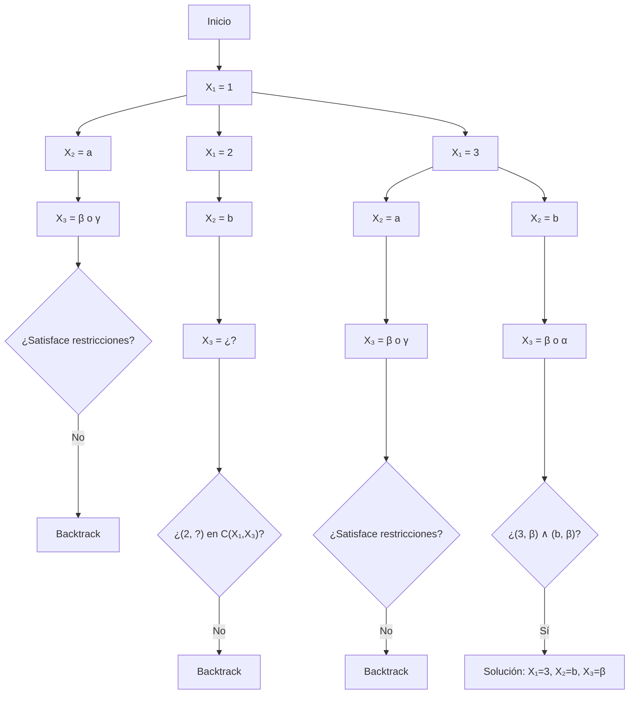

## Problema 1

1. Considere el problema de satisfacción de restricciones (CSP) que se describe a continuación.

- **Variables:** $X_1, X_2, X_3$.
- **Dominios:** $D_1 = \{1, 2, 3, 4\}$, $D_2 = \{a, b, c\}$, $D_3 = \{\alpha, \beta, \gamma\}$.
- **Restricciones:**

$$
C(X_1, X_2) = \{(1, a), (2, b), (3, a), (3, b), (4, b)\}, \tag{1}
$$

$$
C(X_1, X_3) = \{(1, \beta), (3, \beta), (4, \beta)\}, \tag{2}
$$

$$
C(X_2, X_3) = \{(a, \gamma), (b, \beta), (b, \alpha), (c, \gamma)\}. \tag{3}
$$

Resolver el problema usando el algoritmo de *backtracking*.

**Orden de asignación:** $X_1 \to X_2 \to X_3$

**1. Asignar $X_1$**

- Valores posibles: $\{1, 2, 3, 4\}$

- Probamos **$X_1 = 1$**

**2. Asignar $X_2$**

- Dado $X_1 = 1$, buscamos $(1, x)$ en $C(X_1, X_2) \Rightarrow x = a$

- Entonces probamos **$X_2 = a$**

**3. Asignar $X_3$**

Verificamos dos restricciones:

- $(X_1, X_3) = (1, ?)$ debe estar en $C(X_1, X_3) \Rightarrow (1, \beta)$  
- $(X_2, X_3) = (a, ?)$ debe estar en $C(X_2, X_3) \Rightarrow (a, \gamma)$

Pero no hay **intersección** entre los valores válidos:  
$\beta \not= \gamma$ -> **falla**

Volvemos a $X_2$ -> no hay otro valor que cumpla $(1, x)$ en $C(X_1, X_2)$  
-> **backtrack a $X_1$**

**Probar $X_1 = 2$**

$C(X_1, X_2)$: $(2,b)$

-> $X_2 = b$

**Verificar $X_3$**

- $C(X_1, X_3):$ $(2, ?)$ -> **no está en ninguna tupla** -> **falla**  
-> **backtrack**

**Probar $X_1 = 3$**

$C(X_1, X_2): (3,a), (3,b)$ -> probamos **$X_2 = a$**

$C(X_1, X_3): (3, \beta)$  
$C(X_2, X_3): (a, \gamma)$ -> no hay intersección -> **falla**

Probar **$X_2 = b$**

$C(X_2, X_3):$ $(b, \beta), (b, \alpha)$  
Intersección con $(3, \beta)$ => $X_3 = \beta$ válido

### Solución encontrada

$$
X_1 = 3,\quad X_2 = b,\quad X_3 = \beta
$$

### Representación del proceso

