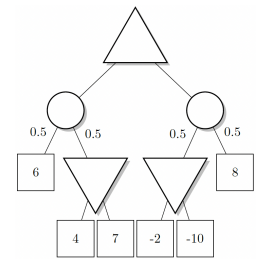

## Problema 2

Considere el juego de suma cero para dos jugadores, con elementos de azar representados en el siguiente árbol.  
Los triángulos que apuntan hacia arriba son nodos de **maximización**, los triángulos que apuntan hacia abajo son nodos de **minimización**, los círculos son nodos de **azar** (con las probabilidades de alcanzar el siguiente nodo indicadas en las aristas salientes), y los cuadrados son **nodos terminales** con el valor correspondiente de la función de utilidad para el jugador que maximiza.

### Calcule el valor **expectiminimax** del nodo raíz y determine la acción elegida por el jugador que maximiza

- Nodo de minimización con hijos: 4 y 7
  $$\min(4, 7) = 4$$

- Nodo de azar con hijos: 6 y 4  
  $$0.5 \cdot 6 + 0.5 \cdot 4 = 3 + 2 = 5$$

- Nodo de minimización con hijos: -2 y -10
  $$\min(-2, -10) = -10$$

- Nodo de azar con hijos: 8 y -10  
  $$0.5 \cdot 8 + 0.5 \cdot (-10) = 4 - 5 = -1$$

- Nodo raíz
  $$\max(5, -1) = 5$$

#### Diagrama

#### Resultado

- **Valor expectiminimax de la raíz**: **5**  
- **Acción elegida**: **ir al subárbol izquierdo**

### ¿Cambiaría el jugador que maximiza de acción si el pago 8 cambiara a 80?

Cambia el nodo derecho:

$$0.5 \cdot 80 + 0.5 \cdot (-10) = 40 - 5 = 35$$

Ahora el nodo raíz decide entre:

- Subárbol izquierdo: 5  
- Subárbol derecho: 35  

$$\max(5, 35) = 35$$

#### Diagrama

#### Resultado

- **Con 8**: elige el **subárbol izquierdo** (valor 5)
- **Con 80**: elige el **subárbol derecho** (valor 35)

**La acción sí cambia si el valor terminal 8 cambia a 80.**
