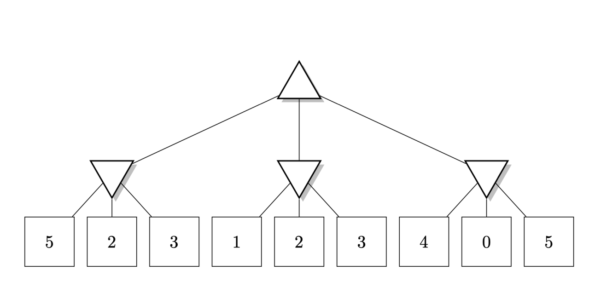

## Problema 3

Considere el siguiente árbol que representa un juego de suma cero, donde los triángulos que apuntan hacia arriba son nodos
de maximizaci´on, los triángulos que apuntan hacia abajo son nodos de minimización y los cuadrados son nodos terminales
con el valor correspondiente de la función de utilidad para el jugador que maximiza
.

### Algoritmo minimax

Empezamos desde abajo en el nodo izquierdo (donde se ubican los nodos con valores {5,2,3}),  vemos que el nivel de arriba tiene nodos que minimizan, por lo que debemos escoger el valor menor, en este caso es 2.

Luego vamos a la parte central {1,2,3}, ya sabemos que el nivel de arriba minimiza, por lo que escogemos 1.

Luego, en el extremo derecho observamos que el valor menor es 0, por lo tanto lo escogemos.

Ahora, con las elecciones realizadas, vemos que el el nivel 2 quedan estos valores: {2, 1, 0}. El nodo raíz tiene el objetivo de maximizar, por lo tanto el mejor camino es el que tiene al número 2, el que está más a la izquierda.

Usando el algoritmo minimax, concluimos que la mejor acción del jugador max es escoger el nodo que está más a la izquierda.

### Poda alpha beta

Seteamos $$\alpha$$ como $$-\inf$$ y $$\beta$$ como $$\inf$$

Ahora, exploraremos el extrremo izquierdo del árbol. Para el nodo con valor 5, alfa permanace como $$-\inf$$ y como beta es mayor que 5, entonces ahora beta = 5.Luego revisamos el siguiente nodo terminal (2), como es meenor que nuestro beta (5), ahora nuestro nuevo beta = 2. Finalmente revisamos el nodo terminal (3), como es mayor que nuestro beta lo descartamos y el valor de ese nodo será 2. Alpha se mantiene como $$-\inf$$ y beta = 2

Ahora vamos con la parte central del nodo. Ahora beta es igual que 2, analizando ls condiciones vemos que el único nodo terminal en esta parte es el 1, por lo que ahora nuestro beta = 1.

Finalmente, en extreo derecho, vemos que el valor menor es 0, actualizamos beta y ahora beta = 0. Ahora debemos tomar la mejor decisión el el nodo raíz, los valores de los nodos del nivel 2 son: {2, 1, 0} y beta = 0 y alpha = $$-inf$$ , como el nodo raíz es un max, ahora hay que actualizar el valor de beta. Vemos que el major valor es 2 y además los otros dos valors cumplen la condición $$\alpha >= \beta$$, por lo tanto descartamos el camino central y el camino derecho del árbol y determinamos que la mejor decisión es el camino más a la izquierda del árbol.
