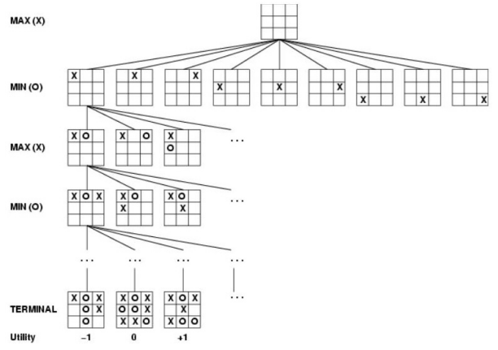

# Contexto

En este laboratorio vamos a resolver un juego adversario de Tic-Tac-Toe usando diferentes algoritmos de búsqueda.

Implementar una clase general llamada Tic-Tac-Toe que simule un juego de "totito" entre dos jugadores "X" y "O", mediante un árbol. Usted siempre es el jugador "X", y el adversario es el jugador "O". Las jugadas son siempre alternas (en ocasiones comenzará a jugar "X", y en otras comenzará el jugador "O").

Los nodos finales del árbol tienen valor $+1$, $0$ ó $-1$ según el juego acabe en victoria de "X", empate o victoria de "O", respectivamente. El valor del score siempre refleja la ganancia o pérdida para el jugador "X" (usted).

