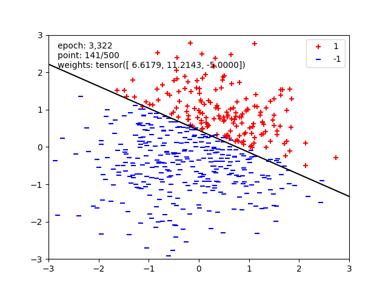

# Proyecto 1 - Machine Learning

Este proyecto implementa un modelo de **perceptrón binario** siguiendo las especificaciones del curso de *Machine Learning* de la Universidad de California, Berkeley. La estructura del proyecto está contenida dentro del directorio:

```markdown
proyectos/proyecto1
```

Para ejecutar los programas, se recomienda [**clonar el repositorio**](https://github.com/JosueSay/IntelligenceArtificial). Se deben instalar las dependencias necesarias ejecutando el siguiente comando:

```bash
pip install -r requirements.txt
```

Una vez instalado todo, se pueden ejecutar las distintas preguntas del autograder con los siguientes comandos para ejecutar cada problema que se menciona en el informe:

```bash
python autograder.py -q q1
python autograder.py -q q2
python autograder.py -q q3
```

Este desarrollo fue realizado conforme a las indicaciones del proyecto de *Berkeley CS188* disponible en el siguiente enlace:

- [Berkeley CS188 - Project 5: Machine Learning](https://inst.eecs.berkeley.edu/~cs188/sp25/projects/proj5/#question-3-6-points-digit-classification)

## Problema 1 - Perceptrón Binario

El **perceptrón** es uno de los modelos más simples y fundamentales del aprendizaje automático supervisado. Fue diseñado para resolver problemas de clasificación binaria, asignando a cada entrada una de dos clases posibles: `+1` o `-1`. Su funcionamiento se basa en una combinación lineal de entradas y una función de activación que determina la clase de salida.

### Contexto del Problema

En este proyecto, se implementó un perceptrón binario utilizando **PyTorch**, una biblioteca eficiente para manipulación de tensores y aprendizaje automático. El objetivo del modelo es separar datos en dos clases, utilizando un vector de pesos que se ajusta iterativamente durante el entrenamiento. Para cada dato de entrada, el perceptrón calcula un puntaje y, en función de este, predice la clase correspondiente.

El modelo opera con tensores, ya que estos permiten cálculos rápidos y eficientes en múltiples dimensiones, lo cual es esencial en contextos de aprendizaje automático. Además, PyTorch ofrece funciones optimizadas como `torch.tensordot`, usada para calcular el **producto escalar** entre el vector de pesos y el dato de entrada, que es la base para decidir la clase.

### Funcionamiento del Perceptrón

El perceptrón recibe un conjunto de entradas $x_1, x_2, ..., x_n$, cada una asociada a un peso $w_1, w_2, ..., w_n$. La salida se calcula con la fórmula:

$$
y = f\left( \sum_{i=1}^{n} w_i x_i + b \right)
$$

Donde $b$ es un sesgo opcional y $f$ es la función de activación. En el caso clásico, se utiliza una **función escalón** (también llamada función signo), que devuelve `+1` si el puntaje es mayor o igual a cero y `-1` en caso contrario.

El **puntaje** representa qué tan alineado está el dato con el vector de pesos. Su signo indica de qué lado de la frontera de decisión se encuentra el dato, y por tanto, la clase asignada.

En esta implementación, no se incluye el sesgo explícitamente, lo cual implica que la frontera de decisión pasa por el origen. Esta simplificación, aunque válida, puede limitar la capacidad del modelo para ciertos conjuntos de datos.

### Entrenamiento del Perceptrón

El entrenamiento sigue una regla de aprendizaje supervisado y consiste en ajustar los pesos para minimizar los errores de clasificación. Se realiza de la siguiente manera:

1. **Inicialización de pesos**: Los pesos inician con valor `1` por requisito del autograder y también para facilitar la observación de los ajustes a lo largo del entrenamiento.
2. **Predicción**: Se calcula el puntaje usando `torch.tensordot`.
3. **Clasificación**: Se convierte el puntaje a una clase usando `torch.where(score >= 0, 1, -1)`.
4. **Corrección**: Si el dato es mal clasificado, los pesos se ajustan con la regla:
   $$
   \mathbf{w} \leftarrow \mathbf{w} + y \cdot \mathbf{x}
   $$
   Esto significa que se está moviendo la frontera de decisión para corregir el error en ese ejemplo.
5. **Repetición**: Se repite este proceso sobre todo el conjunto (una **época**), y se continúa iterando hasta que **todos los datos sean clasificados correctamente** (convergencia) o se alcance un número máximo de iteraciones. Esto significa que el modelo sigue ajustando sus pesos hasta que logra clasificar todos los ejemplos del entrenamiento correctamente, lo que implica que el conjunto es **linealmente separable**. Si los datos no pueden separarse con una línea recta (o hiperplano en dimensiones mayores), el modelo nunca convergerá.

> **Nota:** Durante el entrenamiento, se utiliza `with torch.no_grad()` para desactivar el cálculo de gradientes, ya que el perceptrón no requiere retropropagación.

### Representación Geométrica

Geométricamente, el perceptrón busca encontrar una **recta (en 2D)** o un **hiperplano (en dimensiones mayores)** que divida el espacio de datos en dos regiones, cada una correspondiente a una clase. El vector de pesos actúa como un vector normal a ese hiperplano, y su orientación y magnitud determinan la posición y dirección de la frontera de decisión.

Cuando un dato es clasificado incorrectamente, el modelo ajusta sus pesos desplazando el hiperplano en la dirección del error, lo que mejora su capacidad para separar correctamente los datos.

### Componentes Clave de la Implementación en PyTorch

- `__init__`: Inicializa el vector de pesos en `1`.
- `get_weights`: Devuelve los pesos actuales.
- `run`: Calcula el producto escalar entre pesos y entrada.
- `get_prediction`: Aplica la función escalón y devuelve `+1` o `-1`.
- `train`: Realiza el entrenamiento hasta que no haya errores.
- Validación opcional: Permite evaluar el modelo en datos no vistos para estimar su rendimiento.

### Resultados



El perceptrón binario demostró ser efectivo al clasificar correctamente los datos cuando estos son **linealmente separables**, como se aprecia en la gráfica adjunta. Durante el entrenamiento, la **línea negra** representa la frontera de decisión, la cual se va ajustando conforme se actualizan los pesos, separando progresivamente las dos clases de datos: `+1` (rojos) y `-1` (azules). Esta evolución visual evidencia cómo el modelo aprende y ajusta su frontera para lograr la mejor separación posible.

Además, se observó que dividir el conjunto de datos en **entrenamiento y validación** acelera el proceso de convergencia. Esto se debe a que el conjunto de validación funciona como una guía para evaluar el rendimiento fuera de los ejemplos vistos, ayudando a detectar rápidamente si el modelo está sobreajustando o si aún necesita ajustes. A diferencia de entrenar con todos los datos mezclados, esta separación mejora la estabilidad del aprendizaje y permite una retroalimentación más inmediata sobre la calidad de los ajustes realizados.

Otro aspecto relevante es la importancia del **orden aleatorio (shuffle)** en los datos cuando se entrena con `batch_size=1`. Si los datos se presentan siempre en el mismo orden, es posible que el modelo entre en ciclos de error repetitivos que ralentizan o incluso impiden la convergencia. Al mezclar los datos en cada época, se evita este estancamiento, favoreciendo una separación más eficiente.

Finalmente, las pruebas realizadas sobre el conjunto de validación confirmaron el éxito del entrenamiento, mostrando que el modelo logró clasificar correctamente los datos según la frontera aprendida.

## Problema 2 - Regresión no-lineal

## Problema 3 - Red Neuronal - Clasificación de Dígitos
