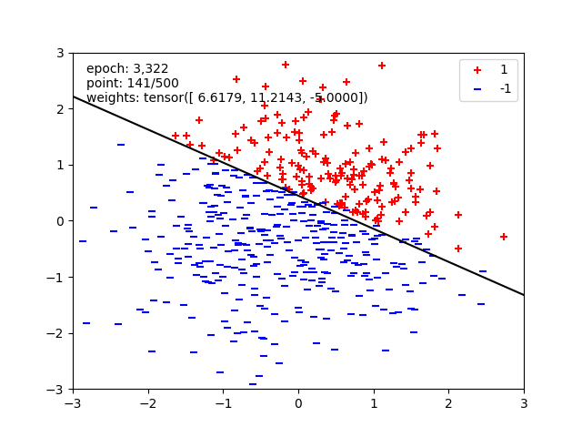

# Informe breve: Implementación del Perceptrón Binario

## Contexto del Problema

El perceptrón binario es un modelo simple de aprendizaje automático utilizado para clasificar datos en dos clases diferentes, etiquetadas como `+1` o `-1`. Su funcionamiento consiste en ajustar iterativamente un vector llamado "vector de pesos" para decidir cómo clasificar correctamente los datos.

En este ejercicio se implementó un perceptrón binario utilizando PyTorch, que es una biblioteca de Python para operaciones eficientes con vectores y matrices (tensores), especialmente diseñada para el aprendizaje automático.

## ¿Cómo funciona un Perceptrón?

El perceptrón utiliza un **vector de pesos** que representa la importancia de cada característica del dato de entrada al hacer una predicción. Para predecir, el perceptrón realiza una operación llamada "producto escalar" entre los datos de entrada y los pesos. El resultado de esta operación indica a qué clase pertenece el dato:

- Si el producto escalar es positivo o cero, la predicción será `+1`.
- Si el producto escalar es negativo, la predicción será `-1`.

Inicialmente, los pesos pueden comenzar con valores aleatorios o valores definidos (en este caso, todos en 1). A través de un proceso iterativo de entrenamiento, el perceptrón ajusta estos pesos cada vez que se equivoca, hasta que logre clasificar todos los datos correctamente.

## Explicación detallada del código implementado

**1. Inicialización (`__init__`)**

```python
self.weight = Parameter(torch.ones((1, dimensions)))
```

- **¿Qué hace?**  
  Crea un vector de pesos inicial con todos los valores en 1.
- **¿Por qué se hace así?**  
  Es un requerimiento del autograder, que exige un tensor en forma `(1, dimensiones)` para verificar correctamente los resultados.

**2. Método para obtener pesos (`get_weights`)**

```python
return self.weight
```

- **¿Qué hace?**  
  Devuelve el vector de pesos actual para revisarlo desde fuera del modelo.

**3. Función de cálculo del puntaje (`run`)**

```python
return torch.tensordot(self.weight, x, dims=([1], [1])).squeeze()
```

- **¿Qué hace?**  
  Calcula el producto escalar entre el vector de pesos y los datos de entrada (`x`).  
- **¿Por qué `torch.tensordot`?**  
  Esta función realiza la multiplicación adecuada de tensores según las dimensiones indicadas. El resultado es el puntaje numérico que determina la clasificación.

**4. Función para obtener predicción (`get_prediction`)**

```python
score = self.run(x)
return torch.where(score >= 0, 1, -1)
```

- **¿Qué hace?**  
  Usa el puntaje calculado para decidir la etiqueta:  
  - Predice `+1` si el puntaje es positivo o cero.  
  - Predice `-1` si es negativo.

**5. Función de entrenamiento (`train`)**

```python
dataloader = DataLoader(dataset, batch_size=1, shuffle=True)
with no_grad():
    converged = False
    while not converged:
        errors = 0
        for batch in dataloader:
            x, y = batch['x'], batch['label']
            prediction = self.get_prediction(x)
            if prediction.item() != y.item():
                self.weight += y * x
                errors += 1
        if errors == 0:
            converged = True
```

- **¿Cómo funciona el entrenamiento?**  
  1. Recorre uno a uno los datos de entrenamiento.
  2. Realiza una predicción para cada dato.
  3. Si la predicción es incorrecta, ajusta el vector de pesos:  
     - Si la etiqueta real es `+1`, suma el dato al peso.  
     - Si la etiqueta real es `-1`, resta el dato al peso.
  4. Si durante una pasada completa no hay errores, significa que el perceptrón aprendió perfectamente a clasificar todos los datos, y se detiene el entrenamiento.

## ¿Por qué funcionó finalmente?

La solución funcionó debido a:

- Se respetó la estructura exigida por el autograder (dimensiones específicas del tensor de pesos).
- Se usaron correctamente las funciones de PyTorch (`tensordot`, `where`) que aseguran operaciones tensoriales adecuadas.
- La lógica de entrenamiento sigue estrictamente el método clásico del perceptrón, ajustando pesos según los errores cometidos en las predicciones.

## Resumen simplificado del algoritmo final

- Inicializa los pesos en 1.
- Para cada dato:
  - Calcula el producto escalar (puntuación).
  - Predice clase según esta puntuación.
  - Si la predicción es incorrecta, ajusta los pesos sumando o restando el dato.
- Repite este proceso hasta no cometer ningún error.

Al completar este proceso, el perceptrón clasifica correctamente todos los datos del conjunto de entrenamiento, alcanzando un rendimiento del 100%.

## Resultado



Esta imagen muestra visualmente cómo el perceptrón separa dos clases (representadas con cruces rojas para la clase `+1` y líneas azules para la clase `-1`). La línea negra indica la frontera de decisión definida por el perceptrón, determinada por los pesos aprendidos (`weights: tensor([6.6179, 11.2143, -5.0000])`).

Los textos significan lo siguiente:

- **epoch: 3,322**  
  El perceptrón ha realizado **3,322 recorridos completos** sobre el conjunto de datos en busca de la separación perfecta.

- **point: 141/500**  
  Indica que está analizando el dato número 141 de un total de 500 en la época actual.

- **weights: tensor([6.6179, 11.2143, -5.0000])**  
  Son los valores actuales del vector de pesos que el perceptrón usa para clasificar puntos.

Esta visualización muestra claramente cómo el perceptrón ajustó los pesos hasta encontrar una línea que separa correctamente ambas clases.
